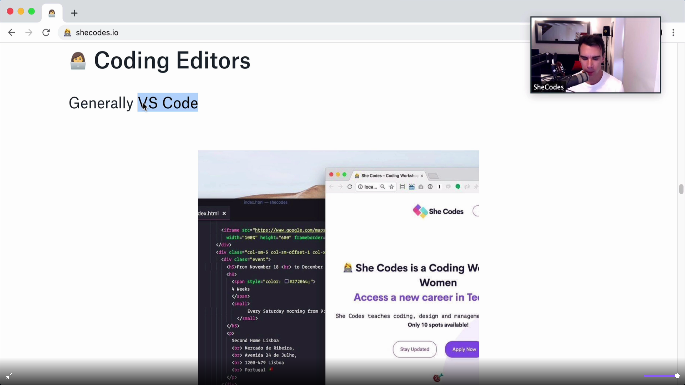

# Learn_dev

## Вопросы JS

<details>
<summary>1.Что такое DOM/BOM API?</summary>
<div> 
Ответ

</div>
</details>

<details>
<summary>5.В чем разница между let, var, const?</summary>
<div> 

Ответ
[В чём разница между var, let и const в JavaScript:](https://medium.com/nuances-of-programming/%D0%B2-%D1%87%D1%91%D0%BC-%D1%80%D0%B0%D0%B7%D0%BD%D0%B8%D1%86%D0%B0-%D0%BC%D0%B5%D0%B6%D0%B4%D1%83-var-let-%D0%B8-const-%D0%B2-javascript-3084bfe9f7a3)     
"Переменная" – это просто свойство специального внутреннего объекта: Environment Record. 
«Получить или изменить переменную», означает, «получить или изменить свойство этого объекта».  

5.1 var - *function scoped*
Если вызвать вне зоны видимости получим ошибку undefined  
Eng: undefined when accessing a variable before it's declared
```javascript
function getDate () {
  var date = new Date()return date
}getDate()
console.log(date) // ❌ Reference Error
```
 Объявленным переменным присваивается значение undefined по умолчанию. Если вы попытаетесь получить
доступ к одной из этих переменных до того, как она была фактически объявлена, вам вернётся undefined 

5.2 let - *block scoped {}* 
Если вызвать вне зоны видимости получим ошибку ReferenceError вместо значения undefined.  
Eng: ReferenceError when accessing a variable before it's declared

```javascript
function discountPrices (prices, discount) {
  let discounted = []for (let i = 0; i < prices.length; i++) {
    let discountedPrice = prices[i] * (1 - discount)
    let finalPrice = Math.round(discountedPrice * 100) / 100
    discounted.push(finalPrice)
  }console.log(i) // 3
  console.log(discountedPrice) // 150
  console.log(finalPrice) // 150return discounted
}discountPrices([100, 200, 300], .5) // ❌ ReferenceError: i is not defined
```

5.3 const - *block scope {}*
Главное отличие const от let - начение переменной, объявленной с помощью const, нельзя переназначить.  

```javascript
let name = 'Tyler'
const handle = 'tylermcginnis'name = 'Tyler McGinnis' // ✅
handle = '@tylermcginnis' // ❌ TypeError: Assignment to constant variable.
```
Но изменение свойства объекта не является его переназначением!
```javascript
const person = {
  name: 'Kim Kardashian'
}person.name = 'Kim Kardashian West' // ✅person = {} // ❌ Assignment to constant variable.
```



</div>

</details>

<details>
<summary>3. Что такое DOM/BOM API?</summary>
<div> 
Ответ

</div>
</details>
